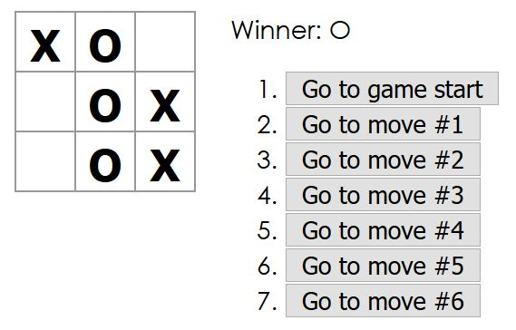
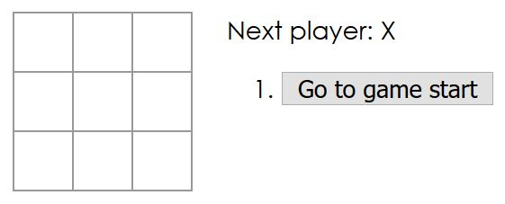

## Introduction

In this tutorial we're going to convert part of a tiny React application into Elm. Here's what the final version of the app is going to look like:



The block of grey buttons on the right represents the history of the tic tac toe game. You can click the various buttons to jump to different points in the game's history. It is this history feature of the tic tac toe game that we'll be converting to Elm. Everything else will be left as it was in React.

## Prerequisites: node and webpack

It's unlikely that you've come to this tutorial not knowing what nodejs is. And it's likely you've already got nodejs installed. But if you don't, install it. You're gonna need it. Once you've got node installed, you need to restore all of the packages we're depending on by running

```
npm install
```

Now that you've retrieved our project dependencies, you'll want to use npm (it comes with nodejs) to install webpack:

```
npm install webpack --global
```

The trickiest bit of this whole tutorial is webpack configuration. Webpack is a bundling tool, and sometimes it changes. It's possible that the webpack.config.js file in this repo will be outdated to the point of not working by the time you read this tutorial. So the very first thing you'll want to do after cloning this repo is to run

```
webpack -d
```

If there aren't any errors - Congratulations! You're past the bumpiest part of this tutorial! If there were errors, then you have my sympathy. I'll be glad to update this tutorial once you've told me about the problem. Or you could figure it out yourself if you prefer. Webpack is kind of unescapable. You might as well buckle down and learn it, and that's not too difficult.

## Some stuff that I did before you got here

We're going to be doing all of our coding in index.jsx. As I explained in the introduction, we're going to be converting the history part of this tic tac toe app over to Elm. The first two steps of that process are to remove all of the history-managing code from the Game component in index.jsx, and to port that history-managing code over to Elm. I have already done this for you. "No fair!" I can hear you saying, "I wanted to write the Elm." Sorry, but interop is the focus of this tutorial, and I'm trying my best to maintain a laser focus. Writing the history code in Elm was pretty easy. Tell you what,  you can try it yourself once we've finished the tutorial!

## Ok, we're finally read to do the Elm interop

There is a simple, two step process for interop with Elm:

1. Embed Elm in your webpage
2. Hook up the ports

Anyone can do it! But before we do, open up index.jsx in your favorite text editor (if you haven't yet), and I'll point out a couple of important things.

Among the import statements at the top of the file, you'll find one like this:

```
import Elm from './elm-component'
```

elm-component is a React component. It is a generic React component for embedding Elm. Wherever you want to embed Elm. The source for elm-component is included in this repo if you want to check it out. You'll see how we use it in just a moment.

Right below the import of elm-component you'll find this guy

```
import { ElmHistoryModule } from './ElmHistoryModule'
```

ElmHistoryModule.elm contains our Elm code. The source. Uncompiled. Through the magic of webpack (and elm-webpack-loader), ElmHistoryModule will get compiled and bundled up with all the rest our javascript.

To complete step 1 of our two step interop process, scroll down to the bottom of the render function in the Game component. The bottom of that render function looks like this:

```jsx
return (
    <div className="game">
        <div className="game-board">
            <Board
                squares={current.squares}
                onClick={i => this.handleClick(i)} />
        </div>
        <div className="game-info">
          <div>{status}</div>
        </div>
    </div>
);

```

We are going to add a new element to the "game-info" div so that it looks like this:

```jsx
<div class="game-info">
	<div>{status}</div>
	<Elm src={ElmHistoryModule} />
</div>
```

Don't forget to save, and step 1 is now complete - Elm is embedded in our webpage! But we need proof, so let's pause for a moment to startup webpack and a webserver of your choice.

## A brief interlude wherein we startup webpack and a webserver of your choice

In your favorite command shell, navigate to the folder containing our tutorial code and run

```
webpack -d --watch
```

webpack should build and bundle our javascript, and then it should continue running. That's because we've started webpack in watch mode. We've got more changes to make in index.jsx, and we want webpack to build automatically as we save those changes.

In another command shell, start up a web server of your choice. Then browse to index.html in your favorite browser. At this point, our tic tac toe app should look like this:



The game board still works perfectly (try it), but the history feature is currently broken. But it totally makes sense for the history feature to be broken. We've not yet finished step 2 of our two step interop process - we still need to hook up the ports!

## Hooking up the ports

Go back to the line in index.jsx where we added our Elm component to the Game's render function. We are going to change our Elm component like so:

```jsx
<Elm src={ElmHistoryModule} ports={ports => game.setupPorts(game, ports)} />
```

We're going to hook up our ports in the setupPorts function. You'll find setupPorts just below the render function, but it's empty right now. Let's fill it up! We are going to have 2 ports: one for sending the current gamestate to Elm when a player makes a move, and another one to pass historical gamestates from Elm to our React Game component. We'll start with the port for sending a historical gamestate from Elm:

```javascript
setupPorts(game, ports) {
    ports.setGamestate.subscribe(function(gamestate) {
        game.jumpTo(gamestate.stepNumber, gamestate.squares);
    });
}
```

setGamestate is a port I defined for sending gamestates out of Elm. My convention for outgoing ports (outgoing relative to Elm) is to give them command-like names. For outgoing ports, you always receive data by calling subscribe. For the case of setGamestate, we will use the historical gamestate we receive to call the Game component's jumpTo function.

Let's move on to our last port - the one for sending new gamestates into Elm:

```javascript
setupPorts(game, ports) {
    ports.setGamestate.subscribe(function(gamestate) {
        game.jumpTo(gamestate.stepNumber, gamestate.squares);
    });
  
  	game.sendGamestate = function(gamestate) {
        ports.gamestates.send(gamestate);
    };
}
```

This port is a little trickier than the first because I had to add a new function to our Game component as part of hooking it up. There's a probably a more elegant way of hooking up event-handling between React and Elm, but this solution is short and simple so it fits our purposes well. If you scroll up to the handleClick function of the Game component you'll see the one and only place in the code where we call sendGamestate.

Let's get back to our ports. Gamestates is a port I defined for sending gamestates into Elm. Gamestates is an incoming port (relative to Elm), and my convention for incoming ports is to name them after the type of data that they accept. For incoming ports, you always pass data by calling send.

Once your setupPorts function looks like the one just above, then you should be able save index.jsx, refresh the webpage and play our fully functional tic tac toe app! (Webpack should already have rebuilt it.)

## What did we learn?

Hopefully we learned that interoperating with Elm is so simple as to be uninteresting. Elm was designed to make interop with javascript simple. Once you know the two step formula you can follow it anywhere and be a huge success!

## What's next?

Honestly, I don't know. Would you like to see an example of interop between Elm and some other framework or library? Drop me a line, and I'll see what I can do!